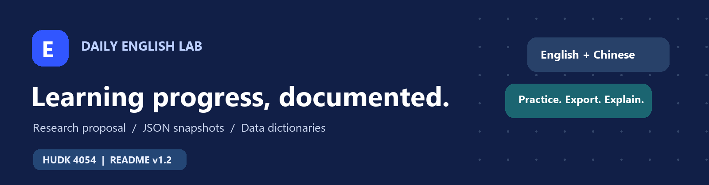
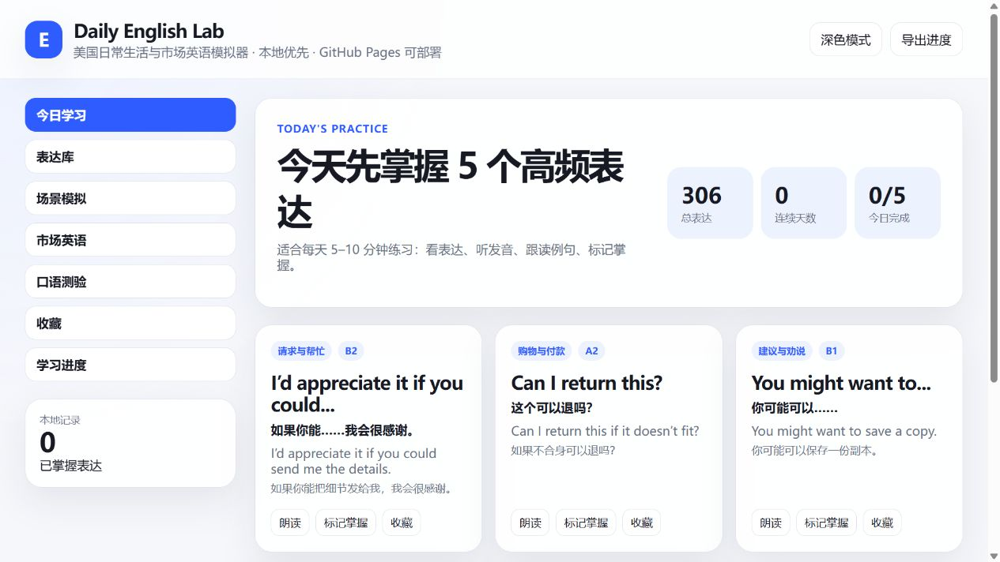
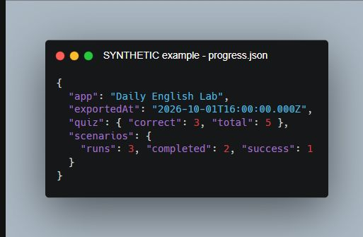

<p align="center">
  
</p>

<h1 align="center">Daily English Lab</h1>
<p align="center"><strong>Learning Progress Metadata</strong><br>A proposed pilot study using the app's JSON progress exports.</p>

<p align="center">
  <a href="https://github.com/SKTT1Bert/us-life-english-simulator"></a>&nbsp;&nbsp;&nbsp;
  <a href="metadata/example_progress_SYNTHETIC.json"></a>
  <br><br>
  <a href="https://ddialliance.org/ddi-codebook"></a>&nbsp;&nbsp;&nbsp;
  <a href="https://orcid.org/0009-0004-4769-1395"></a>
</p>

<p align="center"><a href="https://sktt1bert.github.io/us-life-english-simulator/">Try the app</a> · <a href="https://github.com/SKTT1Bert/us-life-english-simulator">Source code</a> · <a href="metadata/data_dictionary.csv">Data dictionary</a> · <a href="metadata/Daily_English_Lab_README.pdf">PDF copy</a></p>

Version 1.2 | 2026-10-01 | HUDK 4054 Individual Assignment #2

> Status: The app runs on GitHub Pages and can export progress as JSON. This package documents that format for a proposed pilot. The example is synthetic; participant data collection is planned.

<details>
<summary>Contents</summary>

1. [General information](#1-general-information)
2. [Data and files](#2-data-and-files)
3. [Sharing and access](#3-sharing-and-access)
4. [Methods](#4-methods)
5. [Data dictionaries](#5-data-dictionaries)
6. [Metadata standard](#6-metadata-standard)
7. [Assignment reflection](#7-assignment-reflection)
8. [Sources](#8-sources)

</details>

## 1. General information

Daily English Lab offers bilingual expressions, quizzes and branching conversations for everyday English practice. This proposal uses its progress exports to explore how learners use those activities.

**Research question:** What patterns of daily-expression practice, quiz accuracy and scenario completion appear in a small voluntary pilot?

- **Creator and data contact:** Bert Yin (Zhenghui Yin), Teachers College, Columbia University; contact through [GitHub Issues](https://github.com/SKTT1Bert/us-life-english-simulator/issues).
- **ORCID:** [0009-0004-4769-1395](https://orcid.org/0009-0004-4769-1395).
- **Participants:** adult volunteers. Sample size, study duration, dates and collection location will be set before recruitment.
- **Coverage:** English and Chinese content about U.S. situations; English documentation. Keywords: learning analytics, English practice, browser progress.
- **Documentation date:** 2026-10-01. This coursework proposal has no external funding.

## 2. Data and files

One export is a snapshot of progress retained in one browser, not one row per learner or session. The planned study would collect one final export per participant. This package contains one fictional example and no participant records.

| File | Contents |
| --- | --- |
| `README.md` | Project context, methods, access rules and dictionaries. |
| `data_dictionary.csv` | All 18 paths across the export's 12 top-level keys, using the five-column dictionary format shown in Section 5. |
| `expression_dictionary.csv` | The expression library's eight fields. |
| `example_progress_SYNTHETIC.json` | A manually created format example using existing expression IDs. |
| `Daily_English_Lab_README.pdf` | PDF reading copy. |
| `assets/` | Banner, badges, interface screenshot, workflow graphic and Carbon example. |

The source repository contains `app.js`, 306 records in `data/expressions.js`, and 22 everyday settings with 311 tasks in `data/scenarios.js`. `data/marketEnglish.js` supplies a separate market-English module. These are app content, not learner observations.

Real exports use `daily-english-lab-progress-YYYY-MM-DD.json`. The reviewed app uses storage key `daily-english-lab-state-v1`; its README labels the app V7. The dictionary is tied to the reviewed `app.js` blob SHA-1 `2dce96c1226dab44cec88b6ab16781a3e0a23887`. Recheck it if the export code changes.

<details>
<summary>App preview</summary>



*Public interface captured on 2026-10-01 with empty browser progress.*

</details>

## 3. Sharing and access

The [app](https://sktt1bert.github.io/us-life-english-simulator/) and [source repository](https://github.com/SKTT1Bert/us-life-english-simulator) are public. Use **Export Progress** to download local JSON. No explicit license file was found in the reviewed repository; a reuse license still needs to be chosen. This coursework package does not assign one.

Future participant exports would be collected through an institution-approved private channel after consent and any required ethics review. Keep originals and a restricted backup, analyze copies, and keep study codes and consent records separately. Set storage, retention and deletion rules before recruitment. GitHub would contain documentation and synthetic examples; sharing participant-derived results would require consent and disclosure review.

**Documentation DOI (reserved):** `10.5281/zenodo.23090958`. This identifier is reserved for the documentation package and synthetic example. The Zenodo record has not yet been published, and the DOI is not yet registered or active. A participant dataset DOI is not applicable yet.

**Suggested citation:** Yin, B. (2026). *Daily English Lab: Learning Progress Metadata* (v1.2) [Research proposal and documentation].

**Documentation release:** [Version 1.2 on GitHub](https://github.com/SKTT1Bert/us-life-english-simulator/blob/main/README.md).

## 4. Methods

### How the app records progress

The app persists state to the browser `localStorage`. Quiz answers increment counters cumulatively. Correct answers and users can add marks indicating an expression is `learned`; users can delete these marks later. `sessions` tracks unique IDs of expressions learned or answered correctly by UTC day. Scenario counters track the number of starts and each possible ending; `completed` includes runs that succeeded or partially completed each scenario.

Export includes app name and export timestamp in the saved state. It does not track participant IDs, per-answer timestamps, time on task, demographics or proficiency test data. Browser resets, reset-and-imported data, and use by multiple people alters how one may wish to interpret the record.

### Proposed collection and checks

Ask participants that consent to the study to only use one browser for the app and submit a single export to a pre-agreed upon location. Collect study codes outside the app and record if data was reset, imported, or shared separately. Exclude the market module from primary analysis and remove duplicates before summarizing.

Validate JSON syntax, app name, timestamp, IDs of known expressions, and nonnegative integer counters. For each module, enforce that `correct <= total` and `success <= completed <= runs`. Report duplicate IDs or IDs not matching a known expression.

Missing-value conventions are described in Section 5.

### Planned analysis and limits

Summarize the current number of learned items, quiz accuracy (`100 * correct / total`), and scenario completion rate (`100 * completed / runs`). A missing or zero denominator results in the percentage being unavailable. Script analysis in Python 3 and note the version when saving analysis. Note the number of exports used and values missing. Counters are inflated by repeated practice; indicator variables for learned marks should not be considered validated measures of mastery. Such analysis can describe usage of the app, but cannot by itself show that users learn better or that the app had any effect.

## 5. Data dictionaries

Variable is a readable label; Variable name is the exact field or JSON path. Description gives the type and definition. None means no measurement unit.

### Progress export

Dots indicate nested JSON paths. Counts are cumulative within the retained browser state and have no fixed upper bound. Missing keys must be flagged as unknown; `[]`, `{}` and zero counters are valid empty values. IDs refer to the corresponding content library.

| Variable | Variable name | Measurement unit | Allowed values | Description |
| --- | --- | --- | --- | --- |
| Application name | `app` | None | Daily English Lab | String. Name of the exporting application. |
| Export time | `exportedAt` | UTC timestamp | ISO 8601 date-time | String. Snapshot export time; individual activities have no timestamps here. |
| Learned expression IDs | `learned` | IDs | Unique IDs in EXPRESSIONS; [] valid | String array. Current learned marks, set manually or after correct quiz answers. Marks can be removed. |
| Favorite expression IDs | `favorites` | IDs | Unique IDs in EXPRESSIONS; [] valid | String array. Expressions currently saved as favorites. |
| Dated expression records | `sessions` | UTC day and IDs | YYYY-MM-DD keys; arrays of expression IDs; {} valid | Object. Unique expression IDs marked learned or answered correctly on each UTC day; not all activity. |
| Correct daily answers | `quiz.correct` | answers | 0 to quiz.total | Integer. Cumulative correct daily-expression answers. |
| All daily answers | `quiz.total` | answers | Nonnegative integer | Integer. Cumulative daily-expression answers, including repeated attempts. |
| Daily scenario starts | `scenarios.runs` | runs | Nonnegative integer | Integer. Cumulative everyday scenario starts. |
| Daily terminal outcomes | `scenarios.completed` | runs | 0 to scenarios.runs | Integer. Everyday runs ending in success or partial completion. |
| Daily successes | `scenarios.success` | runs | 0 to scenarios.completed | Integer. Everyday runs ending in success. |
| Learned market IDs | `marketLearned` | IDs | Unique IDs in MARKET_VOCAB; [] valid | String array. Market terms marked learned manually or after correct answers. |
| Favorite market IDs | `marketFavorites` | IDs | Unique IDs in MARKET_VOCAB; [] valid | String array. Market terms currently saved as favorites. |
| Correct market answers | `marketQuiz.correct` | answers | 0 to marketQuiz.total | Integer. Cumulative correct market-English answers. |
| All market answers | `marketQuiz.total` | answers | Nonnegative integer | Integer. Cumulative market-English answers, including repeats. |
| Market scenario starts | `marketScenarios.runs` | runs | Nonnegative integer | Integer. Cumulative market scenario starts. |
| Market terminal outcomes | `marketScenarios.completed` | runs | 0 to marketScenarios.runs | Integer. Market runs ending in success or partial completion. |
| Market successes | `marketScenarios.success` | runs | 0 to marketScenarios.completed | Integer. Market runs ending in success. |
| Display theme | `theme` | None | light; dark; pink | String. Saved display preference; excluded from learning analysis. |

### Expression library

Each row in `data/expressions.js` describes one learning item. Progress IDs link to `id`. All eight fields are expected; flag absent fields as unknown. An empty tags array is valid. Difficulty labels describe content, not a participant's proficiency.

| Variable | Variable name | Measurement unit | Allowed values | Description |
| --- | --- | --- | --- | --- |
| Expression identifier | `id` | ID | Unique nonempty identifier | String. Links content to learned, favorites and sessions. |
| English expression | `phrase` | None | English text | String. Expression presented for practice. |
| Chinese meaning | `meaning_cn` | None | Chinese text | String. Chinese explanation of the expression. |
| English example | `example` | None | English text | String. Example sentence containing the expression. |
| Chinese example | `example_cn` | None | Chinese text | String. Chinese translation of the example sentence. |
| Content category | `category` | None | Category labels in the library | String. Topic group used for browsing and progress summaries. |
| Assigned difficulty | `level` | label | A1; A2; B1; B2 | String. App-assigned difficulty; not independently validated or a learner proficiency score. |
| Search tags | `tags` | None | Content tags; [] valid | String array. Keywords used to describe or find expressions. |

### Synthetic example

The [full JSON example](metadata/example_progress_SYNTHETIC.json) contains all 12 top-level keys. Its dates and counts are fictional and demonstrate the format.

<details>
<summary>View the Carbon preview and copyable excerpt</summary>



```json
{
  "app": "Daily English Lab",
  "exportedAt": "2026-10-01T16:00:00.000Z",
  "quiz": { "correct": 3, "total": 5 },
  "scenarios": { "runs": 3, "completed": 2, "success": 1 }
}
```

</details>

## 6. Metadata standard

This README follows **DDI-Codebook 2.6** concepts for documenting a study, its files, access conditions and variables. The dictionaries follow OSF's guidance. This is a Markdown document organized around DDI concepts, not a validated DDI XML record.

## 7. Assignment reflection

**Which metadata standard did you choose and why?**

I selected DDI-Codebook because the framework links variable definitions to both the purpose of the study as well as how and why the data were collected. That was compatible with my learning analytics initiative where a counter label isn't necessarily descriptive of what it counts.

**Which template/software did you use?**

Structurally, I used Make a README, Awesome README, Markdownify, and Rachael Abraham's ReadMe File as references. I used OSF's How to Make a Data Dictionary to properly define variables and create rules for missing values. Shields.io hosts all of the badges, and Carbon generated the synthetic JSON excerpt. Codex assisted with formatting.

**What was most challenging, and how did you address it?**

The hardest thing for me was creating the specification before gathering data from participants. By utilizing the app’s current export format to determine the variables, labeling the sample JSON as synthetic, separating the app's current offerings from the proposed study, and marking the DOI as pending assignment, I was able to outline what currently exists without showcasing planned features as finished.

## 8. Sources

- [App code](https://github.com/SKTT1Bert/us-life-english-simulator/blob/main/app.js) and [expression library](https://github.com/SKTT1Bert/us-life-english-simulator/blob/main/data/expressions.js), reviewed 2026-10-01.
- [DDI-Codebook](https://ddialliance.org/ddi-codebook) and [How to Make a Data Dictionary (OSF)](https://help.osf.io/article/217-how-to-make-a-data-dictionary).
- [Make a README](https://www.makeareadme.com/), [Awesome README examples](https://github.com/matiassingers/awesome-readme) and [Markdownify example](https://github.com/amitmerchant1990/electron-markdownify).
- [Shields.io](https://shields.io/badges), [Carbon](https://carbon.now.sh/) and the [first](https://www.youtube.com/watch?v=a8CwpGARAsQ) / [second](https://www.youtube.com/watch?v=E6NO0rgFub4) tutorials, read through the supplied transcripts.
- HUDK 4054 Week 4 lecture and Rachael Abraham's *ReadMe File_Rachael Abraham.pdf*, used for structure.
